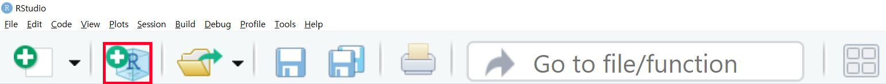
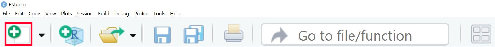

# Preparing for the course

```{r include=FALSE}
knitr::opts_chunk$set(warning=FALSE, message=FALSE)
```
This Chapter helps you prepare for the course. It shows how to install R and RStudio on your computer. We'll also provide some general information on R, and how you can get help if you get error messages. 

If you're already using R, all of this might be nothing new for you. You may **skip** this chapter then.

If you have **never used R before, this Chapter is essential**, as it gives you some input on how R works, and how we can use it for our data analyses.


## Installing software 

Before we start the course, we have to install three things:

* **R**, a free program for statistical programming
* **RStudio**, a user interface which makes it easier to work with R; overlook our data, packages and output. 
* Several **packages**, which are 'add-ons' for R with functions to do specific analyses. They also include the documentation (help files) that describes how to use them, and sample data.


<br><br>

---

### 1. Installing R

- The latest R Version is available [here](https://cran.r-project.org)
-	Based on your operating system (Linux, Mac, Windows), click Download.
    -	If you use **Windows**, click Download R for Windows: Find ‘base’ under subdirectories -> Click ‘install R for the first time’ -> Click Download R 3.6.3 (or another version) for Windows
    -	If you use **Mac**, click Download R for (Mac) OS X: Find the header ‘Latest release’ -> Click R-3.6.3.pkg (or another version)
    -	If you use **Linux**, click Download R for Linux: Choose your Linux distribution (debian/, redhat/, suse/, ubuntu/) -> Open the terminal -> Run the installation command

### 2. Installing RStudio

```{r, echo=FALSE, fig.width=3,fig.height=2}
library(png)
library(grid)
img <- readPNG("rstudiologo.PNG")
grid.raster(img)
```

Download RStudio on the **RStudio** Website ([Link](https://www.rstudio.com/products/rstudio/download/)). It's free!

### 3. Installing packages {#installpackages}

As a prerequisite for this guide, you need to have a few essential **R packages** installed.

1. Open RStudio
2. Inside RStudio, find the window named **Console** on the bottom left corner of your screen (it might fill the entire left side of the screen).
3. We will now install a few packages using R Code. Here's an overview of the packages, and why we need them:

```{r,echo=FALSE}
library(kableExtra)
Package<-c("lavaan", "ggplot2", "tidySEM", "semTools", "psych", "foreign", "readxl")
Description<-c("A sophisticated and user-friendly package for structural equation modeling", "A flexible and user-friendly package for making graphs", "Plotting and tabulating the output of SEM-models", "Comparing models, establishing measurement invariance across groups", "Descriptive statistics", "Loading data from SPSS '.sav' files", "Loading data from Excel '.xslx' files")
m<-data.frame(Package,Description)
names<-c("Package", "Description")
colnames(m)<-names
kable(m)
```
  
<br><br>
4. To install these packages, we use the `install.packages()` function in R. One package after another, our code should look like this:

```{r, eval=FALSE}
install.packages("tidySEM", dependencies = TRUE)
```

```{block, type='rmdachtung'}
Don't forget to put the package names in `""`. Otherwise, you will get an error message.
```


<br><br>

### Get started

### Starting a new project in Rstudio
 
To keep all your work organized, you should use a **project**. In Rstudio, click on the *New project* button:



In the pop-up dialog, click *New directory*, and again *New project*.

type the desired directory name in the dialog (give it a meaningful name, e.g. "TCSM_course"), and use 'Browse' if you need to change the directory where you store your projects. Now, in your project, click *File > New file > R script*. This script file works just like notepad, or the syntax editor in SPSS: You type plain text, but you can run it any time you want. Conduct all of the exercises in this script file.

### Code conventions

Throughout the guide, a consistent set of conventions is used to refer to code:

* Functions are in a code font and followed by parentheses, like
`sum()` or `mean()`.
* Other R objects (like data or function arguments) are in a code
font, without parentheses, like `seTE` or `method.tau`. 
* Sometimes, we’ll use the package name followed by two colons, like
`lavaan::sem()`. This is valid R code and will run. The `lavaan::` part indicates that the function `sem()` comes from the package `lavaan`.

### Getting Help

As you start to apply the techniques described in this guide to your data you will soon find questions that the guide does not answer. This section describes a few tips on how to get help.

1. Every function in R has documentation (a help file). To see it, select the name of the function and press F1, or run the command `?` followed by the name of the function, e.g.: `?aov`. I have been using R for 10 years, and I still press F1 all the time to see how a function works.
2. Andy Field, the book used for our undergraduate statistics courses [@field2012discovering], is also available for R. Many basic analyses are explained for R in this book.
3. If you get stuck, start with **Google**. Typically, adding “R” to a search is enough to restrict it to relevant results, e.g.: "exploratory factor analysis R". Google is particularly useful for error messages. If you get an error message and you have no idea what it means, try googling it. Chances are that someone else has been confused by it in the past, and there will be help somewhere on the web. (If the error message isn’t in English,
run `Sys.setenv(LANGUAGE = "en")` and re-run the code; you’re
more likely to find help for English error messages.)
4. If Google doesn’t help, try [stackoverflow](https://stackoverflow.com). Start by spending a little time searching for an existing answer; including [R] restricts your search to questions and answers that use R.
5. Lastly, if you stumble upon an error (or typos!) in this guide's text or R syntax, feel free to contact **Caspar van Lissa** at **c.j.vanlissa@uu.nl**.

## Getting the course data

All of the course data files are available on a GitHub repository. You can download them all at once by going to https://github.com/cjvanlissa/TCSM_student, clicking the green button labeled 'Code', and downloading a ZIP archive of the repository.


After unzipping the archive, you can open the RStudio project 'TCSM_student.Rproj', and the script 'run_me.R'. This script contains a few lines of code to help you install the required R-packages for the course.

## R tutorial for beginners (optional)

Welcome to the world of R! This tutorial is based on the tutorial "R: How to get started" by [Ihnwhi Heo](https://www.linkedin.com/in/ihnwhi-heo/), [Duco Veen](https://www.ducoveen.com/), and [Rens van de Schoot](https://www.rensvandeschoot.com/), and adapted for TCSM.

### Who R you?

R is...

-	Free programming software for statistical computation and graphics
-	Open source: everyone (even you!) can improve, develop, and contribute to R
-	The official manual by the R Core Team: [An introduction to R](https://cran.r-project.org/doc/manuals/r-release/R-intro.pdf)

R itself looks a bit old-fashioned and tedious:


### RStudio

Thankfully, we have a great user interface for R, called RStudio!

-	RStudio helps users to use and learn R easier
-	If you are using RStudio, this means you are using R.
-	From now on, all tutorials will go with RStudio.

#### No ‘pane’, no gain!

When you open RStudio, the screen may look like this. You may notice that the screen is divided into A ‘panes’ (a pane is a division of a window): 


Before we explain these three panes - I want you to add the fourth one, which you will see if you open an R script. An R script is like a "new document" in Microsoft Word. When you open an R script, the fourth pane appears.

#### Create a new R script

Click the icon with a plus sign on the paper. Click the icon highlighted by the red square: 




When you click the icon, a new script appears in a fourth pane on the upper left side of the screen


The four panes really help become organized. In RStudio, you can do everything all together on one screen. Thus, four panes make the work efficient (indeed, no ‘pain’!).

#### What do the four panes do?

-	Out of four panes, the two on the left side are the panes you will use a lot.
    -	Source pane: located at the top left side of the screen. It is also called the "editor", because this is where we edit scripts. We will usually type our code in the source pane.
    -	Console pane: located at the bottom left side of the screen. This panel is for direct communication with R. We can type commands here that are *immediately* evaluated (whereas a script is only evaluated when we run it). Furthermore, all output of our commands is printed in this console pane.
-	The panels on the right side of the screen contain various tabs. Among those tabs, it is worth looking at the Environment tab at the upper pane and the Plots tab at the lower pane.
    -	The Environment tab contains all the ‘objects’ currently loaded in your R session. In SPSS, you can have only one data file open. In R, you can have as many data 'objects' as you like. They will be listed here. You can always check what objects are loaded under the environment tab. The environment is also called the 'workspace'.
    -	The Plots tab shows various graphs and figures we draw. If you click Zoom with the magnifying glass, you can see plots in a bigger size.


### Loading data

-	Statistical analysis cannot happen without data. In R, you can load data in various ways. Let’s see the easiest way.
- To download the dataset (``LifeSat``) for this tutorial, click [here](https://github.com/Rensvandeschoot/Tutorials/raw/master/R/LifeSat.sav).

#### Mouse clicks

-	Click File -> Import Dataset -> Choose the type of dataset. In this tutorial, we will use the SPSS dataset. Thus, click ‘From SPSS’.
-	Suddenly, you may encounter an Install Required Packages pop-up with a message that asks you whether you want to install the `haven` package now. A package is an "enhancement" for R; in this case, an enhancement to allow it to read SPSS files.

<center>

</center>

-	Click ‘Yes’.
-	Then, the Import Statistical Data pop-up appears -> See File/URL -> Click Browse at the right end -> Open your file
-	You will see your data in the Data Preview.
-	If you look at the Import Options, you can set the name of your data file and the format of it.
-	All of your ‘mouse-clicking’ is being translated to the R-code required to load your file. In the Code Preview, the steps required for loading the data are expressed in terms of code.
-	Now, it’s time to load your data to R. How? Just click Import at the lower right side of the pop-up.
-	In our example, the name of the dataset is ``LifeSat``.


#### Loading data with R code

-	Let’s try to load the data with R code.
-	In this course, we use the `read.spss` function from the `library(foreign)`. It works best with all exercises.
- Write the following code in an R-script:

```{r, echo = TRUE, eval = FALSE}
library(foreign)
LifeSat <- read.spss("TCSM_student/LifeSat.sav", to.data.frame = TRUE, use.value.labels = FALSE)
View(LifeSat)
```
```{r, echo = FALSE, eval = TRUE}
library(foreign)
LifeSat <- read.spss("LifeSat.sav", to.data.frame = TRUE, use.value.labels = FALSE)
```

- Select these lines with the mouse.
- Press the Ctrl and Enter buttons together.
- The lines of code are now evaluated by R, and R is telling you the result of its actions in the console pane.

There are many different ways to load data into R. During this course, we will see a few of them.

### Explore your data

-	As you saw, you can type some R codes in the source pane and run the codes by pressing Ctrl and Enter together to make R work. If you look at the R codes we used in loading the data, you see the instructions ``read_sav()`` and ``View()``. These are called functions. A functions is an instruction for R to perform a task.
-	When you use functions, you should type certain comments or inputs in the parentheses, which make the functions work. Those comments or inputs are called arguments. Let’s learn three new functions with their arguments. They are used in understanding the data.

#### head()

-	The data consist of many rows. If you would like to inspect the first several rows (to see how the data look), the ``head()`` function achieves your purpose.
-	For the ``head()`` function, you will use only one argument: The name of the dataset.

```{r}
# Inspect the first several rows
head(LifeSat)
```

-	“Wait, what is the hash tag (#) doing there?” Don’t be surprised. The hash tag creates a "comment"; a bit of text that will not be evaluated by R. This is useful because we can write notes to help us remember what we are doing when there are many lines of code. Writing comments also helps when you have someone else review your code.
-	Let’s run the code by pressing Ctrl and Enter together. R shows you the first six rows of the dataset in the console pane.
-	You may be curious about some `NA`s in the output. `NA` refers to ‘Not Available’. Those are missing values. 

#### Extracting one variable

It is possible to extract a variable from the data using the dollar sign, `$`. In R, the dollar sign means: Take this object (a variable) out of another object (the data). In the example below, we ask R to take the variable `LifSat` out of the data.frame ``LifeSat``:

```{r}
LifeSat$LifSat
```

We see all 98 unique values.

#### Extracting rows and columns

It is possible to extract rows or columns from the data using `data[row_numbers, col_numbers]`. For example, the first four rows of the first two columns:

```{r}
LifeSat[1:4, 1:2]
```

By leaving either rows or columns empty, we get all rows or columns:

```{r}
LifeSat[ , 1:2]
```


```{r}
LifeSat[1:2, ]
```

We can refer to columns by name, too:

```{r}
LifeSat[1:2, c("age", "educ")]
```


#### str()

-	It is of interest to know what types of variables are in the dataset. For example, if you want to run an analysis of variance (ANOVA), the independent variable should be categorical, and we should check if it is the case.
-	For this purpose, you can use the ``str()`` function; where `str` is short for structure. In running this function, you need one argument, which is again the name of the dataset.

```{r}
# Structure of the dataset
str(LifeSat)
```

-	According to the output in the console pane, the dataset consists of 1,491 observations and 6 variables. This means that our dataset has 1,491 rows and 6 columns.
-	It is written that respnr: num 1 2 3 4 5 6 7 8 9 10 … It means that the respnr variable is a number (abbreviated as num), and 1 is the value in the first row, 2 is the value in the second row, 3 is the value in the third row, and so on.

#### summary()

-	How can we know about the mean, median, minimum, and maximum of the variables of interest? You can get the descriptive statistics of the variables with the ``summary()`` function. Again, you only need one argument, which is the name of the dataset. 

```{r, eval = FALSE, echo = TRUE}
summary(LifeSat)
```

-	Let’s look at the output in the console pane. The descriptive statistics per variable is given. For example, for the variable `LifSat`, the minimum value is 1.455, the median is 3.636, and the mean is 3.628.

This summary is a bit messy; you can get a nicer summary using the `describe()` function from the `psych` package. We will learn more about this in the course.

## Plotting the data (optional)

It is always a good idea to look into your data visually. For example, you would like to know the relationship between two specific variables in your data, the distribution of values, and more.

We will introduce three basic functions for plotting data. After you run these functions, the output appears in the Plots tab at the lower right pane.

For plots, we use the `ggplot2` package. If the package will not load when you run the code below, you may have skipped some essential steps in \@ref(installpackages).

```{r}
library(ggplot2)
```


### A histogram

Are you curious about how the values of a continuous variable are distributed? Drawing a histogram is one way of examining the distribution.

```{r, fig.align="center"}
# Set up the data for the plot and select the variable to plot using aes:
ggplot(data = LifeSat, aes(x = LifSat)) +
  geom_histogram() # Add a histgram
```


### A boxplot

A boxplot shows you how the data are dispersed from the median and whether the outliers exist. Let’s draw the boxplot of the variable, `LifSat`. Can you guess how to do this?

```{r, fig.align="center"}
# Same set up as in the previous example:
ggplot(data = LifeSat, aes(x = LifSat)) +
  geom_boxplot() # Add a boxplot
```

### Scatterplot

What if we are interested in visually investigating the relationship between two variables, `LifSat` and `age`, in the data? One possible solution is to draw a scatterplot. In addition to the `x` variable from the previous examples, we can also specify a `y` variable:

```{r, fig.align="center"}
# Set up the data for the plot and select the variable to plot using aes:
ggplot(data = LifeSat, aes(x = LifSat, y = age)) +
  geom_point() # Add scatter
```

This code gives you the scatterplot of the two variables, `LifSat` and `age`. The variable, `LifSat`, is at the x-axis and the variable, `age`, is at the y-axis.

#### Analyze your data

-	One of the strengths of R is its flexibility in running statistical analyses and producing graphical outputs. In the first week of the course, we will perform some standard analyses in R that you are already familiar with from previous courses.


