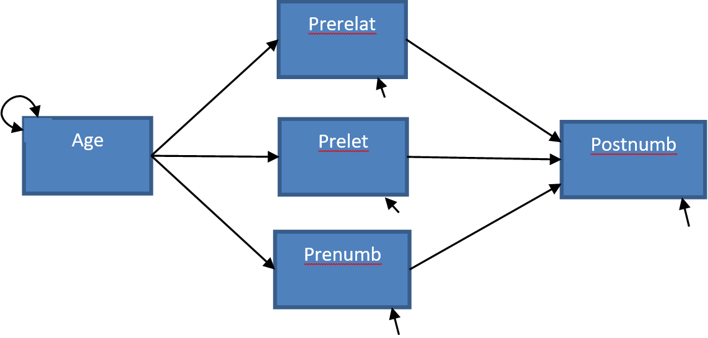

# Week 1 - Class

```{r setup, include=FALSE}
knitr::opts_chunk$set(echo = TRUE, message = FALSE, warning = FALSE)
show_answers <- TRUE
```

During the practical you will work on some exercises about ANOVA and ANCOVA using regression and path modeling. Note that ANOVA and ANCOVA are special cases of regression, as discussed during MTS3 or a similar course. How to perform an ANOVA/ANCOVA as a regression analysis is prerequisite knowledge. 

This practical we will work on these topics (ANOVA, ANCOVA, regression and how they are related). If you need to refresh your knowledge you could use the internet to find information or you could look it up in a book on statistics, for example @field2012discovering (*The chapters on ANOVA, Factorial ANOVA, and ANCOVA (11.6)*).

We start with two exercises in which you have to explore your data and perform a regression analysis, ANOVA and an ANCOVA. You will also practice with performing an ANCOVA as a regression analysis in exercise 3 today.


## Loading data

Open the file Sesam.sav:

```{r, message=FALSE}
# Library for reading SPSS files:
library(foreign)
# Load the data and put them in the object called "data"
data <- read.spss("sesam.sav", to.data.frame = TRUE, use.value.labels = FALSE)
```

This file is part of a larger dataset that evaluates the impact of the first year of the Sesame Street television series. Sesame Street is mainly concerned with teaching preschool related skills to children in the 3-5 year age range.

The following variables will be used in this exercise:

* **age** 	measured in months
* **prelet**	knowledge of letters before watching Sesame Street (range 0-58)
* **prenumb**	knowledge of numbers before watching Sesame Street (range 0-54)
* **prerelat**	knowledge of relations before watching Sesame Street (range 0-17)
* **peabody**	vocabulary maturity before watching Sesame Street (range 20-120)
* **postnumb** 	knowledge of numbers after a year of Sesame Street (range 0-54)

## Section 1

### Question 1.a

What is the level of measurement of each of the variables?

<details>
  <summary>Click for explanation</summary>
In the 'Environment' panel in the top right corner of the screen, click the arrow in the next to the object called 'data'. Alternatively, run the rode: `head(data)`.

```{r echo = FALSE}
knitr::include_graphics("measurement_level.png")#, out.width = "456px")
```
</details> 

### Question 1.b

What is the average age in the sample? And the range (youngest and oldest child)? 

*Hint: Use install.packages("psych"); library(psych); describe()*

<details>
  <summary>Click for explanation</summary>
The package `psych` contains many functions for exploring data. Install and load the package, then use the `describe()` function to describe the data:

```{r, eval = FALSE}
install.packages("psych")
library(psych)
describe(data)
```
```{r, echo=FALSE}
library(psych)
describe(data)
```
<\details>

### Question 1.c

What is the average gain in knowledge of numbers? Provide both the mean and the standard deviation. 

*Hint: Use the <- operator to assign to a new variable in data. Functions mean() and sd().*

<details>
  <summary>Click for explanation</summary>
Create a new variable that represents the difference between pre- and post-test scores:

```{r}
data$dif <- data$postnumb - data$prenumb
```

There are specialized functions to obtain the mean and sd:

```{r}
mean(data$dif)
sd(data$dif)
```
<\details>

### Question 1.d

Choose an appropriate graph to present the gain scores. What did you choose and why?

*Hint: Several useful plotting functions for univariate distributions are:* `hist(); plot(density()); boxplot()`

<details>
  <summary>Click for explanation</summary>
```{r include = show_answers}
plot(density(data$dif))
```
<\details>

### Question 1.e

Can you think of a graph based on two variables that is informative? What is it and how is it informative?

*Hint: A useful plotting function for a bivariate distribution is the scatterplot:* `plot(data$x, data$y)`

<details>
  <summary>Click for explanation</summary>
```{r include = show_answers}
#Possible variables would be the pre- and post measurement
plot(data$prenumb, data$postnumb)
```
<\details>


### Question 1.f

Which of the variables age, prelet, prenumb, prerelat and peabody are significantly related to postnumb? Use Pearson’s correlations (`cor()`). You don’t need to check assumptions.

*Hint: The function* `cor()` *provides Pearson's correlations. Select variables by name from a data.frame object (like* `data`*) using the following syntax:

<details>
  <summary>Click for explanation</summary>
```{r}
cor(data[, c("age", "prelet", "prenumb", "prerelat", "peabody", "postnumb")])
```

The use of `data[,]` follows the conventions of matrix indexation: You can select rows (the horizontal lines) like this, `data[i, ]`, and columns (the vertical lines) like this, `data[ ,j]`, where i are the rows and j are the columns you want to select. As you can see in the example, you can select multiple columns using c( ... , ... ).
<\details>

### Question 1.g

Can age and prenumb be used to predict postnumb? If so, discuss the substantial importance of the model and the significance and substantial importance of the separate predictors.

*Hint: The function* `lm()` *(short for linear model) conducts linear regression. The functions* `summary()` *provides relevant summary statistics for the model. It can be helpful to store the results of your analysis in an object, too.*

<details>
  <summary>Click for explanation</summary>
```{r}
results <- lm(formula = postnumb ~ age + prenumb, 
              data = data)
summary(results)
```
<\details>

### Question 1.h

Provide the null hypotheses and the alternative hypotheses of the model in 1.g.

<details>
  <summary>Click for explanation</summary>
The null-hypotheses of the **model** pertain to the variance explained: $\rho^2$ (that's Greek letter rho, for the population value of $\rho^2$).

$H_0: \rho^2 = 0$

$H_a: \rho^2 > 0$
<\details>

### Question 1.i

Consider the path model below. How many regression coefficients are estimated in this model? And how many variances? And how many covariances? How many degrees of freedom does this model have? ($df = N_{obs} – N_{par}$, see slides Lecture 1). 

```{r echo = FALSE}
#, out.width = "456px")
```

### Question 1.j

Consider a multiple regression analysis with three continuous independent variables, tests in language, history and logic, and one continuous dependent variable, a score on a math test. We want to know whether the various tests can predict the math score. Sketch a path model for this analysis (there are examples in the lecture slides of week 1). 

How many regression parameters are there? How many variances could you estimate? 
How many covariances could you estimate? How many degrees of freedom does this model have?

## Section 2

Open the file Drivers.sav.

### Research question 1 (ANOVA): Does talking on the phone interfere with people’s driving skills?

IV: condition

* hand-held phone
* hands-free phone 
* control

DV: reaction time in milliseconds in a driver simulation test.

```{r, message=FALSE}
# Load the data and put them in the object called "data"
data <- read.spss("Drivers.sav", to.data.frame = TRUE)
```

### Question 2.a

Perform the ANOVA. 

*Hint: The function* `aov()` *is an alternate interface to the linear model (lm), which reports results in line with the convention of ANOVA analyses.*

<details>
  <summary>Click for explanation</summary>
```{r, message=FALSE}
results <- aov(formula = RT ~ condition, data = data)
summary(results)
```
<\details>

### Question 2.b

What are the assumptions you need to check?

<details>
  <summary>Click for explanation</summary>
We can check several assumptions:

1. Presence of outliers
2. Normality of residuals
3. Homogeneity of residuals

Let's deal with them in order.

#### Presence of outliers:

**In Y-space**

We can check the range of the standardized (`scale()`) residuals for outliers in Y-space.  The residuals are **inside** of the results object, so we can just extract them, standardize them, and get the range:

```{r}
range(scale(results$residuals))
```

What is your conclusiong about the outliers?

#### Normality of residuals

We can check the normality of residuals using a QQplot.

```{r}
qqnorm(results$residuals)
qqline(results$residuals)
``` 

There appears to be some mild deviation from normality at the extremes.

You can also **test** for normality with the `shapiro.test(x)` function:

```{r}
shapiro.test(results$residuals)
``` 

#### Homogeneity of Variances

The `bartlett.test()` function provides a parametric K-sample test of the equality of variancse. This test has the same hypotheses as the Levene's test.

```{r}
bartlett.test(formula = RT~condition, data = data)
```

It can also be nice to use a paneled boxplot to visualize the distributions. For this, we will use the package `ggplot2`:

```{r, eval = FALSE}
install.packages("ggplot2")
library(ggplot2)
ggplot(data, aes(y = RT, group = condition)) +
  geom_boxplot() +
  theme_bw()
```


```{r, echo = FALSE}
library(ggplot2)
ggplot(data, aes(y = RT, group = condition)) +
  geom_boxplot() +
  theme_bw()
```
<\details>

### Question 2.c

Explain for each of the assumptions why they are important to check.

### Question 2.d

What are your conclusions regarding the assumption checks?

<details>
  <summary>Klik voor meer uitleg</summary>
    There are no outliers in X-space, no evidence for (severe) deviations from normality of residuals, and no evidence for (severe) heteroscedasticity.
</details> 

### Question 2.e

Answer the research question. 

*Hint: Use* `summary()` *and* `TukeyHSD()`*.*

<details>
  <summary>Click for explanation</summary>
  We can examine the overall F-test, which is significant:
  
```{r, message=FALSE}
summary(results)
```

Post-hoc tests with Bonferroni correction can be obtained using `TukeyHSD(results)`. We notice that none of these comparisons are significant. However, the research question was *Does talking on the phone interfere with peoples driving skills?* There are two conditions for talking on the phone. We could thus test a planned contrast of these two conditions against the control condition, instead of all possible post-hoc tests:

The standard contrasts are dummy coded:

```{r, message=FALSE}
contrasts(data$condition)
```

We can replace these with planned contrasts for "phone" vs control, and hand-held vs hands-free:

```{r, message=FALSE}
contrasts(data$condition) <- cbind(phoneVcontrol = c(-1, -1, 2), handVfree = c(-1, 1, 0))
results <- aov(RT ~ condition, data)
# Ask for the lm summary, which gives you t-tests for the planned contrasts:
summary.lm(results)
```
<\details>

### Research question 2 (ANCOVA): Are there differences in reaction time between the conditions when controlling for age? 


### Question 2.f

What are the assumptions you need to check?

<details>
  <summary>Click for explanation</summary>
  Assumptions for ANCOVA are the same as for ANOVA (no outliers, normality of residuals, homoscedasticity). ANCOVA has the following additional assumptions:

* Homogeneity of regression slopes for the covariate (no interaction between factor variable and covariate)
* The covariate is independent of the treatment effects. I.e. there is no difference in the covariate between the groups of the independent variable.

<\details>


### Question 2.g

Explain for each of the assumptions why they are important to check.

### Question 2.h

Check the assumptions of ANCOVA.

*Hint: Within formulas, you can use* `*` *instead of* `+` *to include interaction effects.*


<details>
  <summary>Click for explanation</summary>
  
#### Homogeneity of regression slopes

Add the interaction to the model and test whether the interaction is significant:

```{r}
results_age <- aov(RT ~ condition + age, data)
results_age_int <- aov(RT ~ condition * age, data)
summary(results_age_int)

#Or you could use `anova()` to compare two different models
anova(results_age, results_age_int)
```

What would your conclusion be about this assumption?

<details>
  <summary>Click for explanation</summary>
The interaction is NOT significant; no evidence for violation of the assumption.
<\details>

#### The covariate is independent of the treatment effects

```{r}
results_indep <- aov(age ~ condition, data)
summary(results_indep)
```
What would your conclusion be about this assumption?

<details>
  <summary>Click for explanation</summary>
The covariate is not significantly related to treatment effect. The assumption is met.
<\details>

<!--#### Outliers in X-space

In addition to the aforementioned outliers in Y-space, we can now test for (multivariate) outliers in X-space using Mahalanobis' distance. In this case, we only have one continuous covariate. The function requires a **matrix** of data, a vector of means for centering the data, and a covariance matrix. In the syntax below, we use `drop = FALSE` when extracting a single column from the data, in order to make sure that the data will still be in matrix format when we extract only one column. This is necessary for the underlying matrix algebra. We have to take the `sqrt()` because the function `mahalanobis()` returns the **squared** Mahalanobis' distances.

```{r}
mahal <- sqrt(mahalanobis(data[ , "age", drop = FALSE], 
                          center = mean(data$age),
                          cov = cov(data[, "age", drop = FALSE])))
range(mahal)
```
<\details>
-->

### Question 2.i

Answer the research question. (Do you have to include the interaction or not?)


<details>
  <summary>Click for explanation</summary>
```{r, message=FALSE}
results <- aov(formula = RT ~ condition + age, data = data)
TukeyHSD(results)
```

The handheld-condition has a significant **higher** reaction time than the control condition

<\details>


## Section 3

Open the file Sesam2.sav. 


```{r, message=FALSE}
# Load the data and put them in the object called "data"
data <- read.spss("Sesam2.sav", to.data.frame = TRUE)
```

Use postnumb as the dependent variable in all the following analyses.

### Question 3.a

Viewcat is a factor variable, but is not coded as such in the data. Turn it into a factor. Afterwards, make sure that viewcat=1 is the reference group in the contrasts, i.e., the group that is identified by zero scores on all the associated dummy variables.

*Hint: Use* `<- factor()` *and* `contrasts()`.

<details>
  <summary>Click for explanation</summary>
  
```{r}
data$VIEWCAT <- factor(data$VIEWCAT)
contrasts(data$VIEWCAT)
```

<\details>

### Question 3.b

Perform a multiple regression analysis with just the viewcat dummies as predictors.

<details>
  <summary>Click for explanation</summary>
  
```{r}
results <- lm(POSTNUMB ~ VIEWCAT, data)
summary(results)
```
<\details>

### Question 3.c

What do the regression coefficients represent? How can you determine the average postnumb score for each of the viewcat categories, based on the regression parameters?

### Question 3.d

Make a coloured scatter plot with age on the x-axis and postnumb on the y-axis. Colour the dots according to the their `viewcat` category. How do you interpret the differences in slopes of these four fit lines?

*Hint: Use* `ggplot(); geom_point(); geom_smooth()`. *Within ggplot, use the aes(colour = '...') to colour according to a certain variable.*

<details>
  <summary>Click for explanation</summary>
  We will use ggplot again:
  
```{r}
ggplot(data, aes(x = AGE, y = POSTNUMB, colour = VIEWCAT)) + 
  geom_point() + # For scatterplot
  geom_smooth(method = "lm", se = FALSE) + # For regression lines
  theme_bw() # For a pretty theme
```
<\details>

### Question 3.e

Add an interaction between age and viewcat to the regression analysis. 

*Hint: An interaction is created by multiplying two variables. You can multiply with \* in the formula of* `lm()`.

<details>
  <summary>Click for explanation</summary>
```{r}
results_interaction <- lm(POSTNUMB ~ VIEWCAT*AGE, data)
summary(results_interaction)
```
<\details>

### Question 3.f

Perform a sequential multiple regression. Include age and viewcat as the predictors in the first analysis. Add the interaction term in the second analysis. Make sure to obtain information about the change in R-square!

*Hint: Use* `anova()` *to compare two regression models.*

<details>
  <summary>Click for explanation</summary>
```{r}
results_main <- lm(POSTNUMB ~ VIEWCAT + AGE, data)
anova(results_main, results_interaction)
```
<\details>

### Question 3.g

Sketch path models of both steps of the regression analysis (on paper). 

### Question 3.h

Write down the regression equations of both steps of the sequential analysis. 


<details>
  <summary>Click for explanation</summary>
$Postnumb_i = b_0 + b_1D_{view2i} + b_2D_{view3i} + b_3D_{view4i} + b_4Age_i + \epsilon_i$

$Postnumb_i = b_0 + b_1D_{view2i} + b_2D_{view3i} + b_3D_{view4i} + b_4Age_i + b_5D_{view2i}Age_i + b_6D_{view3i}Age_i + b_7D_{view4i}Age_i + \epsilon_i$

<\details>

### Question 3.i

Write down the null hypothesis that is tested to determine whether there is an interaction between age and viewcat.

<details>
  <summary>Click for explanation</summary>
$H_0: \Delta\rho^2 = 0$
<\details>

### Question 3.j

Indicate for each parameter in the second regression model what it means. Also write down the regression equation for each of the four categories of viewcat separately.

### Question 3.k

What do you conclude about the interaction between age and viewcat?

### Question 3.l

Note that you can also look at this problem as an ANCOVA. What are the research question and null hypothesis in this case?

<details>
  <summary>Click for explanation</summary>
RQ: Is there a significant difference between the marginal means of postnumb by viewcat, after controlling for age?

$H_0:$ After controling for age, the mans of postnumb are equal in all groups.

<\details>

### Question 3.m

Perform this analysis as an ANCOVA.

*Hint: Add* `-1` *to a formula to drop the intercept.*
<details>
  <summary>Click for explanation</summary>
  To drop the intercept from the analysis, and estimate the marginal means for all viewcat categories, we can add `-1` (minus the intercept) to the formula:
  
```{r}
results_ancov <- aov(POSTNUMB~AGE+VIEWCAT-1, data)
```
<\details>

Examine the parameter estimates of the ANCOVA. What do the parameter estimates represent?

<details>
  <summary>Click for explanation</summary>
We use summary.lm() again to obtain the parameter estimates:

```{r}
summary.lm(results_ancov)
```
The parameter estimates are the means of each VIEWCAT category when age = 0.

<\details>
